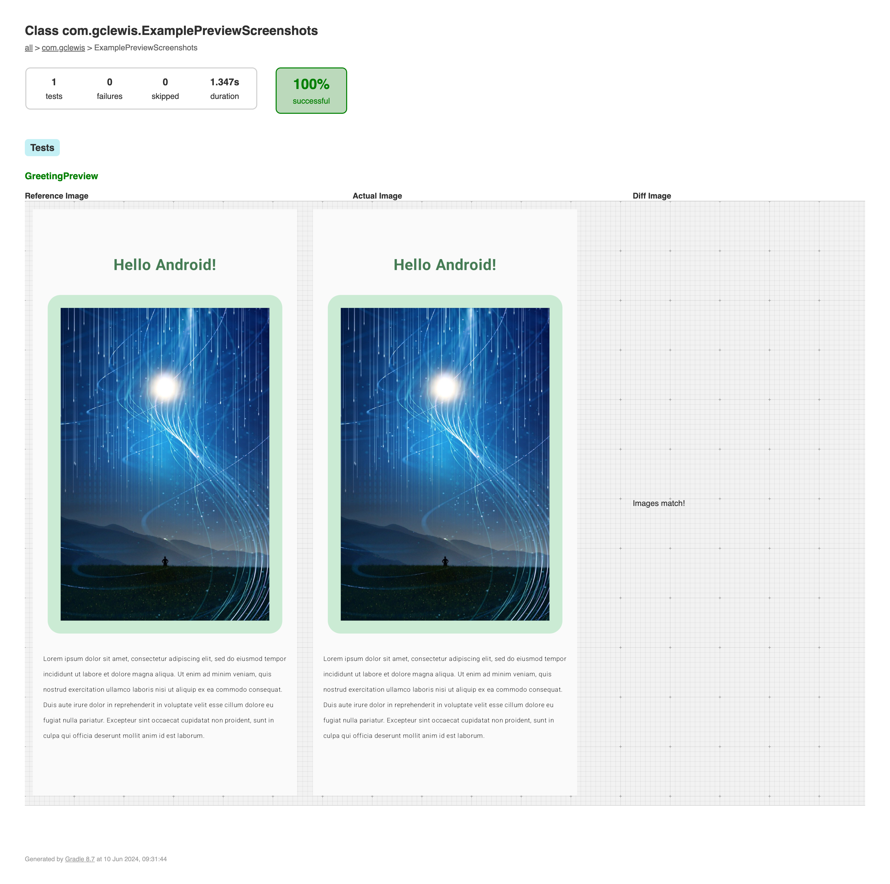
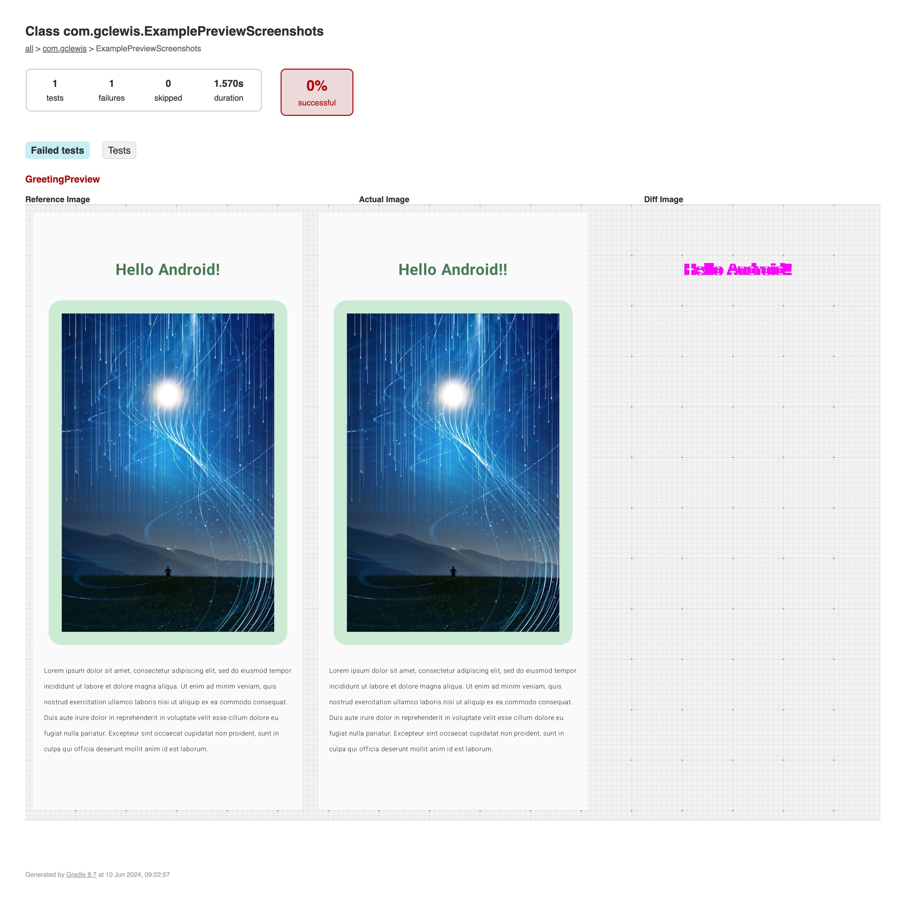

# Screenshot Testing for Android Application Development

This is based on the `preview` [documentation from Google](https://developer.android.com/studio/preview/compose-screenshot-testing) (as at 6 June 2024) and an excellent video by [Philipp Lackner](https://www.youtube.com/watch?v=2L78_eCNDs8) which adds native Android Studio support for Screenshot testing.

## Running the tests

```shell
./gradlew updateDebugScreenshotTest    # Create initial set of reference images
./gradlew validateDebugScreenshotTest  # Test current images against reference images
```

- Reference images created in `app/src/debug/screenshotTest/reference`
- Test results created in `app/build/test-results/validateDebugScreenshotTest`
- HTML report created in `app/build/reports/screenshotTest/preview/debug/index.html`

## HTML Report Output

| Passing Test | Failing Test |
| --- | --- |
|  |  |
